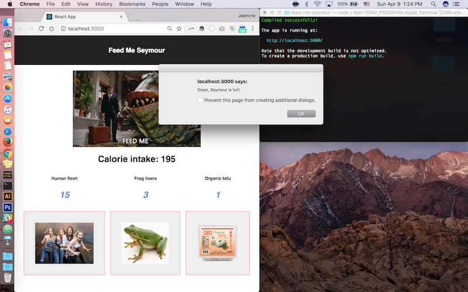

# feed-me-seymour

To get started, use `npm start`.

```shell
cd feed-me-seymour
npm start
```

You will create a parent component, named `Seymour`, which has an initial state of `calories: 0`, and contains children components that will display `Seymour`'s menu choices. Each child component will have a calorie value. You will be able to feed Seymour and add to his `calories` by passing a `feedMeSeymour` function to each of the children components. `Seymour` can also have a `maxCalories` property to alert when he is full and reset `calories`.

Check out the source code at `src/components/Seymour.js`.


