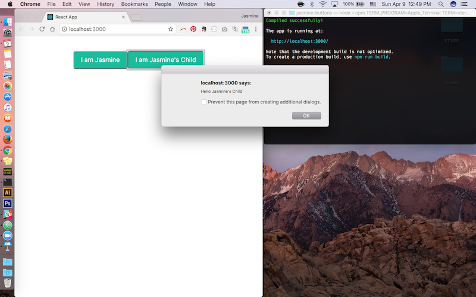

# jasmine-buttons

To get started, use `npm start`.

```shell
cd jasmine-buttons
npm start
```

You will create two buttons, named `ParentComponent` and `ChildComponent`, to pass data dynamically from one component to another.

Check out the source code at `src/index.js`.


